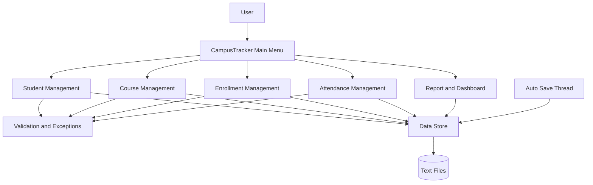
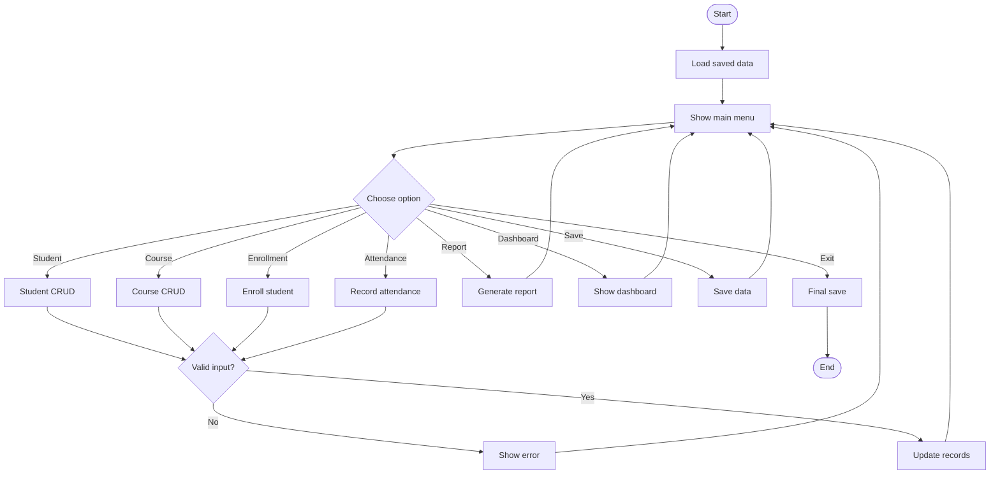
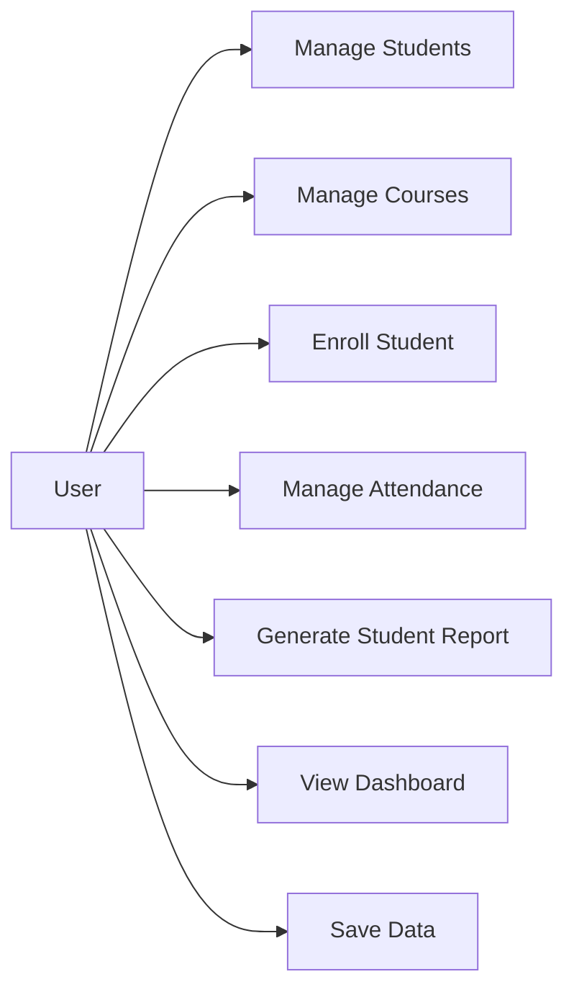
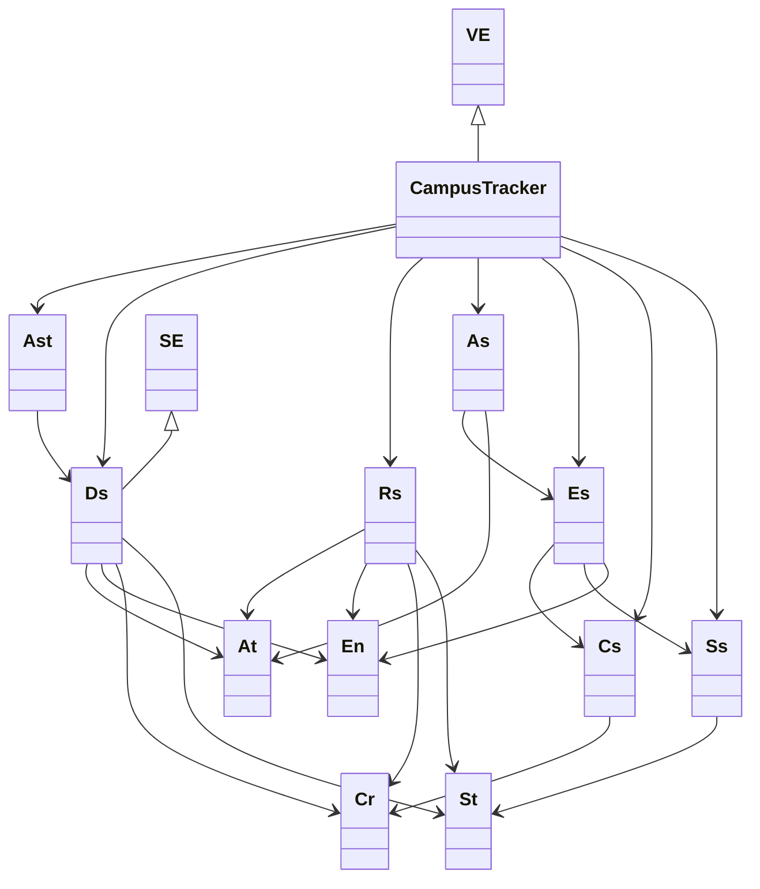
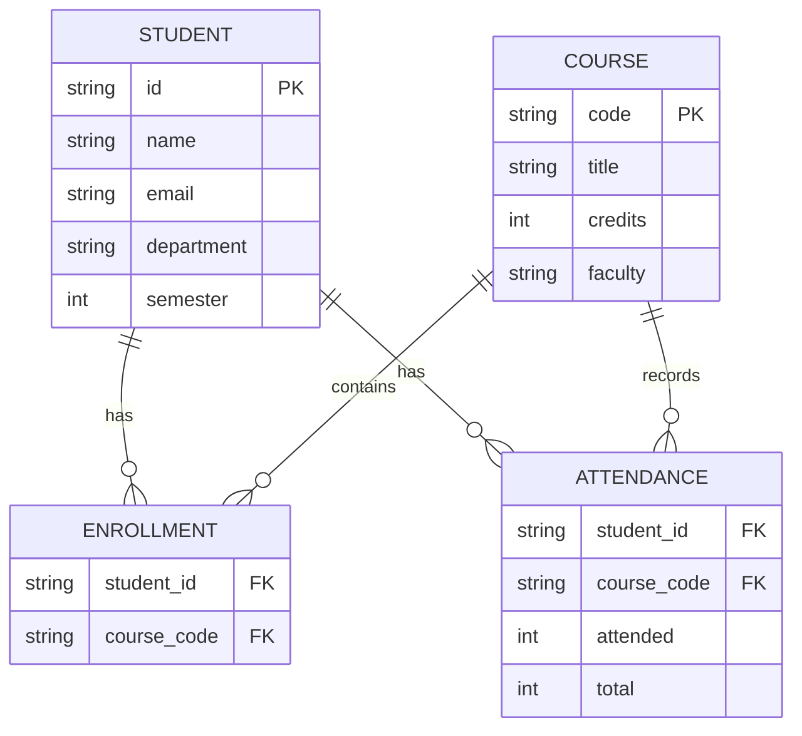

# CampusTracker Design Diagrams

## 1. System Architecture

## 2. Workflow Diagram

## 3. Use Case Diagram

## 4. Class Diagram

## 5. Storage Schema

The project uses text-file persistence instead of a relational database.

